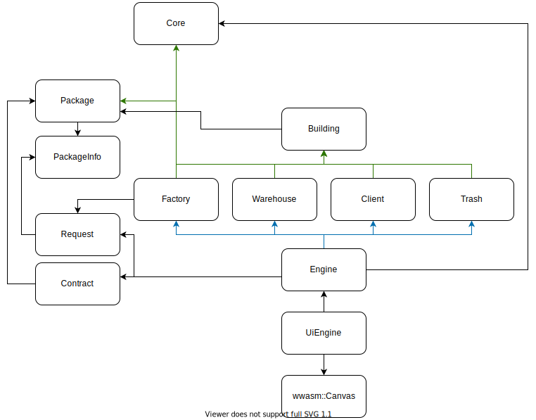
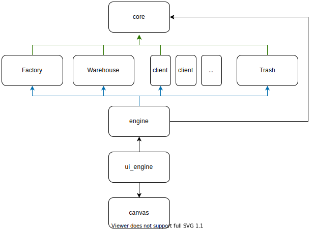
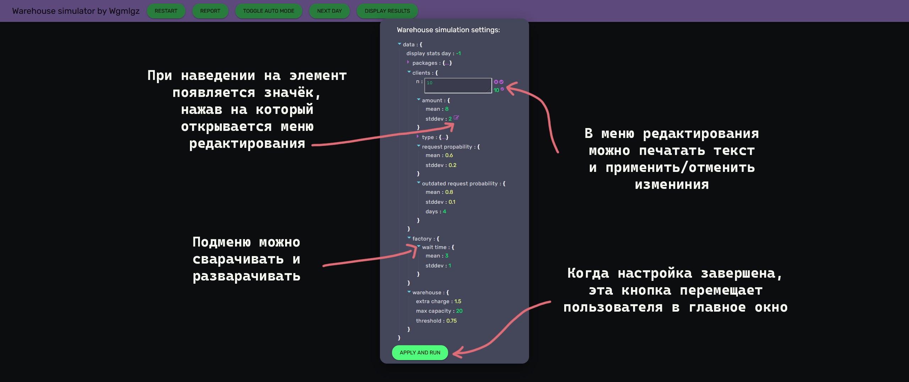
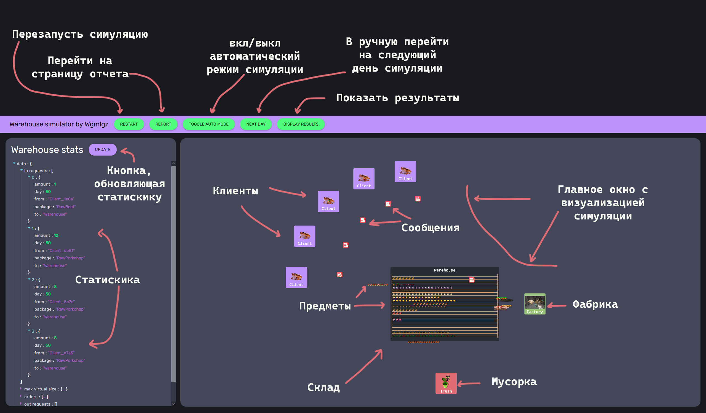
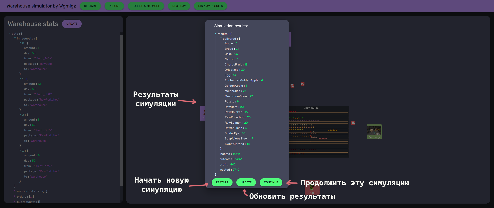

# Система управления оптовым складом
## Результат работы


В результате работы мной былы написанна программа, которая согласно данному заданию симулирует работу оптового склада. Программа позволяет задать стартовые параметры и посмотреть на симуляцию.


## Диаграмма классов, показывающая выделенные классы и отношения между ними





## Спецификация основных классов программы


```cpp
/** Хранит данные абстрактного строения */
class Building {
  /** возвращает id cтроения */
  idt id()
  /** помещает пакет в своё хранилище */
  virtual void pushPackage(std::shared_ptr<Package> package)
  /** возвращает свое имя */
  virtual std::string name()
};
```

```cpp
/** Хранит данные склада */
class Warehouse : public Building {
  /** Помещает пакет в своё хранилище */
  virtual void pushPackage(std::shared_ptr<Package> package)
  /** Геттеры и сеттеры */
  auto& shelf(const std::string& s)
  auto& getShelfs() { return shelfs; }
  auto& virtualSize(const std::string& s)
  auto getThreshold(const std::string& s)
  auto getMaxSize()
  auto& getMaxVirtualSize(const std::string& s)
  auto& getScore(const std::string& s)
  auto& delivered(const std::string& s)
  auto& delivered()
  auto& score()
  auto& maxVirtualSize()
  auto getIncome()
  auto getOutcome()
  auto getWasted()
  auto getProfit()
  /** Финансовые операции */
  auto earn(int n)
  auto spend(int n)
  auto waste(int n)
  /** Возвращает свое имя */
  virtual std::string name() override
};
```


```cpp
/** Хранит данные слиента */
class Client : public Building {
  /** Генекирует тип пакета */
  int packageRng(auto& rng)
  /** Генекирует количество пакетов */
  int amountRng(auto& rng)
  /** Геттеры */
  auto getRequestProbability()
  auto getOutdatedRequestProbability()
  /** Возвращает свое имя */
  virtual std::string name()
};
```

```cpp
/** Хранит данные фабики */
class Factory : public Building {
  /** Геттеры */
  int genWaitTime(auto& rng)
  auto& getRequestQueue()
  /** Возвращает свое имя */
  virtual std::string name()
};
```

```cpp
/** Мусорка */
class Trash : public Building {};
```

```cpp
/** Контроллер для wwasm::Canvas */
class UiEngine {
  /* Переходит на следующий день */
  void nextDay()
  /* Обновляет UiEngine */
  void update()
};
```

```cpp
class Engine {
  /* Обновляет Engine */
  void update()
};
```


## Диаграмма объектов, показывающая основные объекты и их связи





## Зависимости


* [wwasm](https://github.com/Wgmlgz/wwasm) - моя C++ библиотека для связи reactjs и C++
* [nlohmann/json](https://github.com/nlohmann/json) - C++ библиотека для работы с JSON
* [reactjs](https://github.com/facebook/react) - Js библиотека для разработки UI
* [material-ui](https://www.npmjs.com/package/@material-ui/core) - ReactJs библиотека с кравивыми примитивами
* [dracula](https://github.com/dracula/dracula-theme) - цвета темы оформления
* [react-json-view](https://www.npmjs.com/package/react-json-view) - компонент ReactJs для отображения и редактирования JSON


## Описание модульной структуры программы


- ### Buildings.hpp
  ```cpp
  class Building
  class Warehouse
  class Client
  class Factory
  class Trash
  ```
- ### Core.hpp
  ```cpp
  struct Core
  ```
- ### Engine.hpp
  ```cpp
  class Engine
  ```
- ### Items.hpp
  ```cpp
  struct PackageInfo
  struct Package
  ```
- ### Messages.hpp
  ```cpp
  struct Request
  struct Order
  ```
- ### UiEngine.hpp
  ```cpp
  class UiEngine
  ```


## Краткое описание пользовательского интерфейса


## Страница ввода параметров

## Главная страница

## Результат работы программы



